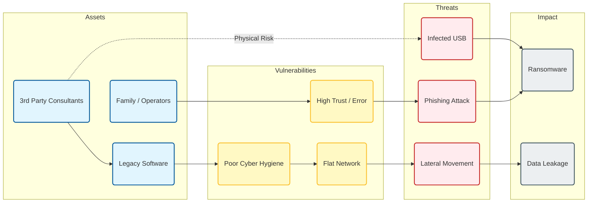

```mermaid
graph LR 
    %% --- STYLING & FONTS ---
    %% Increasing default font size and node padding
    classDef default fontSize:16px,fontFamily:Arial,fill:#fff,stroke:#333,stroke-width:2px,rx:5,ry:5,padding:10px;
    
    %% Specific styles for colors
    classDef asset fill:#e1f5fe,stroke:#01579b, fontSize:24px;
    classDef vuln fill:#fff9c4,stroke:#fbc02d,fontSize:24px;
    classDef threat fill:#ffebee,stroke:#c62828,fontSize:24px;
    classDef impact fill:#eceff1,stroke:#455a64,fontSize:24px;
    
    %% Style for the Right-Side Mitigation Box (Green, Bold, Large)
    classDef mit fill:#e8f5e9,stroke:#2e7d32,stroke-width:4px,fontSize:24px,align:left;


        
        
        %% COLUMN 1: ASSETS
        subgraph Col1 ["Assets"]
            direction TB
            Family(Family / Operators)
            Consultants(3rd Party Consultants)
            LegacySW(Legacy Software)
        end

        %% COLUMN 2: VULNERABILITIES
        subgraph Col2 ["Vulnerabilities"]
            direction TB
            Trust(High Trust / Error)
            NoTech(Poor Cyber Hygiene)
            FlatNet(Flat Network)
        end

        %% COLUMN 3: THREATS
        subgraph Col3 ["Threats"]
            direction TB
            Phish(Phishing Attack)
            USB(Infected USB)
            Lateral(Lateral Movement)
        end
        
        %% COLUMN 4: IMPACT
        subgraph Col4 ["Impact"]
            direction TB
            Ransom(Ransomware)
            DataLoss(Data Leakage)
        end


    %% --- CONNECTIONS ---
    
    %% Asset -> Vuln
    Family --> Trust
    Consultants --> LegacySW
    LegacySW --> NoTech

    %% Vuln -> Threat
    Trust --> Phish
    NoTech --> FlatNet
    Consultants -.->|Physical Risk| USB

    %% Threat -> Impact
    Phish --> Ransom
    USB --> Ransom
    FlatNet --> Lateral
    Lateral --> DataLoss


    %% --- APPLY CLASSES ---
    class Family,Consultants,LegacySW asset;
    class Trust,NoTech,FlatNet vuln;
    class Phish,USB,Lateral threat;
    class Ransom,DataLoss impact;

```