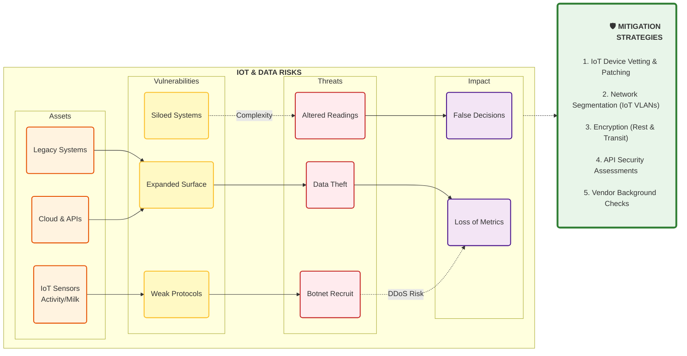

```mermaid
graph LR
    %% --- STYLING & FONTS ---
    classDef default fontSize:16px,fontFamily:Arial,fill:#fff,stroke:#333,stroke-width:2px,rx:5,ry:5,padding:10px;
    
    %% Specific styles for colors
    classDef asset fill:#fff3e0,stroke:#e65100;
    classDef vuln fill:#fff9c4,stroke:#fbc02d;
    classDef threat fill:#ffebee,stroke:#c62828;
    classDef impact fill:#f3e5f5,stroke:#4a148c;
    
    %% Style for the Right-Side Mitigation Box
    classDef mit fill:#e8f5e9,stroke:#2e7d32,stroke-width:4px,fontSize:16px,align:left;

    %% --- MAIN DIAGRAM ---

    subgraph Operation ["<b>IOT & DATA RISKS</b>"]
        direction TB
        
        %% COLUMN 1: ASSETS
        subgraph Col1 ["Assets"]
            direction TB
            Legacy(Legacy Systems)
            Sensors(IoT Sensors<br/>Activity/Milk)
            CloudAPI(Cloud & APIs)
        end

        %% COLUMN 2: VULNERABILITIES
        subgraph Col2 ["Vulnerabilities"]
            direction TB
            Surface(Expanded Surface)
            WeakProto(Weak Protocols)
            Silo(Siloed Systems)
        end

        %% COLUMN 3: THREATS
        subgraph Col3 ["Threats"]
            direction TB
            Intercept(Data Theft)
            BadData(Altered Readings)
            Botnet(Botnet Recruit)
        end
        
        %% COLUMN 4: IMPACT
        subgraph Col4 ["Impact"]
            direction TB
            BadDecisions(False Decisions)
            MetricLoss(Loss of Metrics)
        end
    end

    %% --- RIGHT SIDE BOX ---
    MitigationBox["
    <div style='text-align:right; font-weight:bold; color:#1b5e20; margin-bottom:5px;'>🛡️ MITIGATION STRATEGIES</div>
    1. IoT Device Vetting & Patching <br/>
    2. Network Segmentation (IoT VLANs) <br/>
    3. Encryption (Rest & Transit) <br/>
    4. API Security Assessments <br/>
    5. Vendor Background Checks
    "]

    %% --- CONNECTIONS ---
    
    %% Asset -> Vuln
    Legacy --> Surface
    Sensors --> WeakProto
    CloudAPI --> Surface

    %% Vuln -> Threat
    WeakProto --> Botnet
    Surface --> Intercept
    Silo -.->|Complexity| BadData

    %% Threat -> Impact
    Intercept --> MetricLoss
    BadData --> BadDecisions
    Botnet -.->|DDoS Risk| MetricLoss

    %% Connecting the flow to the Mitigation Box
    Col4 -.-> MitigationBox

    %% --- APPLY CLASSES ---
    class Legacy,Sensors,CloudAPI asset;
    class Surface,WeakProto,Silo vuln;
    class Intercept,BadData,Botnet threat;
    class BadDecisions,MetricLoss impact;
    class MitigationBox mit;
```