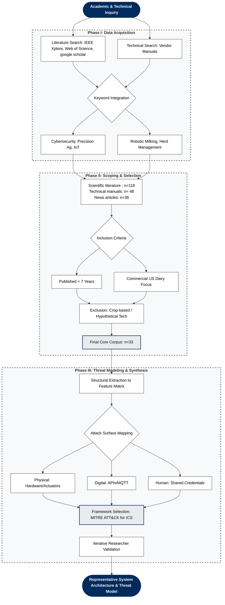

```mermaid 
graph TD
    %% Node Definitions
    Start([Academic & Technical Inquiry])
    
    subgraph Phase1 [Phase I: Data Acquisition]
        A[Literature Search: IEEE Xplore, Web of Science, google scholar]
        B[Technical Search: Vendor Manuals]
        C{Keyword Integration}
        C1[Cybersecurity, Precision Ag, IoT]
        C2[Robotic Milking, Herd Management]
    end

    subgraph Phase2 [Phase II: Scoping & Selection]
        D[Scientific literature : n=118
         Technical manuals: n= 48
          News articles: n=36  ]

        E{Inclusion Criteria}
        E1[Published < 7 Years]
        E2[Commercial US Dairy Focus]
        F[Exclusion: Crop-based / Hypothetical Tech]
        G[Final Core Corpus: n=33]
    end

    subgraph Phase3 [Phase III: Threat Modeling & Synthesis]
        H[Structural Extraction to Feature Matrix]
        I{Attack Surface Mapping}
        I1[Physical: Hardware/Actuators]
        I2[Digital: APIs/MQTT]
        I3[Human: Shared Credentials]
        
        J[Framework Selection: MITRE ATT&CK for ICS]
        K[Iterative Researcher Validation]
    end

    Output([Representative System Architecture & Threat Model])

    %% Connections
    Start --> A & B
    A & B --> C
    C --> C1 & C2
    C1 & C2 --> D
    D --> E
    E --> E1 & E2
    E1 & E2 --> F
    F --> G
    G --> H
    H --> I
    I --> I1 & I2 & I3
    I1 & I2 & I3 --> J
    J --> K
    K --> Output

    %% Academic Styling
    classDef default fill:#ffffff,stroke:#333,stroke-width:1px,color:#000;
    classDef phase fill:#f8f9fa,stroke:#444,stroke-width:2px,stroke-dasharray: 5 5,font-weight:bold;
    classDef highlight fill:#e9ecef,stroke:#002b5c,stroke-width:2px;
    classDef terminal fill:#002b5c,stroke:#002b5c,color:#fff,font-weight:bold;

    class Phase1,Phase2,Phase3 phase;
    class G,J highlight;
    class Start,Output terminal;
```