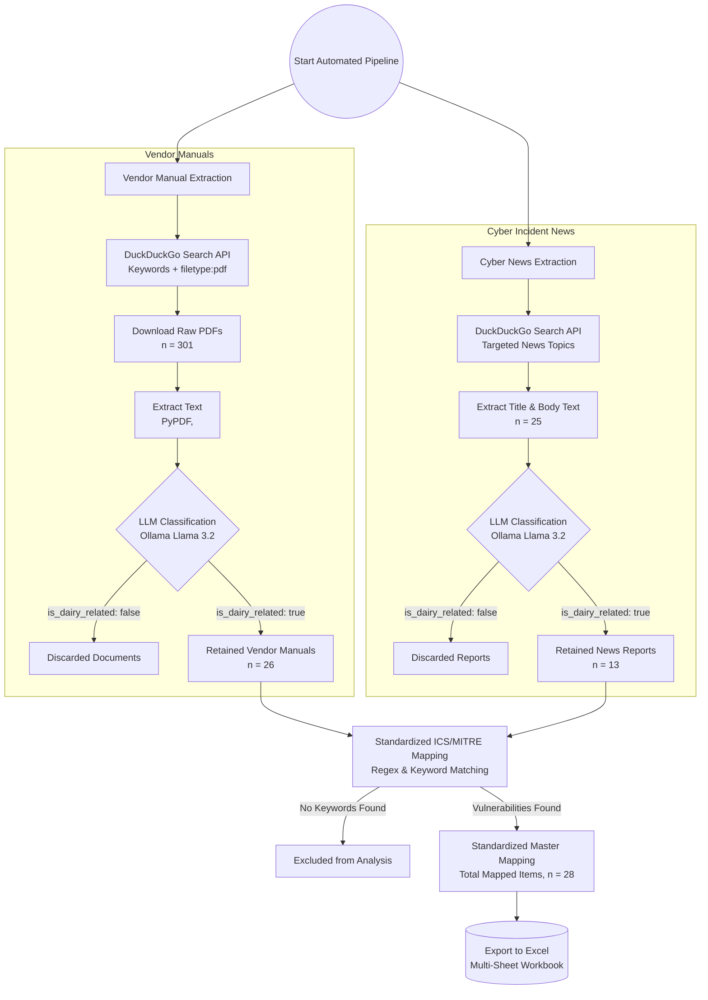

```mermaid
graph TD
    %% Define main entry points
    Start((Start Automated Pipeline)) --> Vendor[Vendor Manual Extraction]
    Start --> News[Cyber News Extraction]

    %% Vendor Manual Branch
    subgraph Vendor Manuals
        Vendor --> V_Search[DuckDuckGo Search API<br/>Keywords + filetype:pdf]
        V_Search --> V_Download[Download Raw PDFs<br/>n = 301]
        V_Download --> V_Extract[Extract Text<br/>PyPDF,]
        V_Extract --> V_LLM{LLM Classification<br/>Ollama Llama 3.2}
        V_LLM -- "is_dairy_related: false" --> V_Discard[Discarded Documents]
        V_LLM -- "is_dairy_related: true" --> V_Retained[Retained Vendor Manuals<br/>n = 26]
    end

    %% Cyber News Branch
    subgraph Cyber Incident News
        News --> N_Search[DuckDuckGo Search API<br/>Targeted News Topics]
        N_Search --> N_Extract[Extract Title & Body Text<br/>n = 25]
        N_Extract --> N_LLM{LLM Classification<br/>Ollama Llama 3.2}
        N_LLM -- "is_dairy_related: false" --> N_Discard[Discarded Reports]
        N_LLM -- "is_dairy_related: true" --> N_Retained[Retained News Reports<br/>n = 13]
    end

    %% Vulnerability Mapping Phase
    V_Retained --> Map[Standardized ICS/MITRE Mapping<br/>Regex & Keyword Matching]
    N_Retained --> Map
    Map -- "No Keywords Found" --> M_Discard[Excluded from Analysis]
    
    %% Output
    Map -- "Vulnerabilities Found" --> Master[Standardized Master Mapping<br/>Total Mapped Items, n = 28]
    Master --> Export[(Export to Excel<br/>Multi-Sheet Workbook)]
```