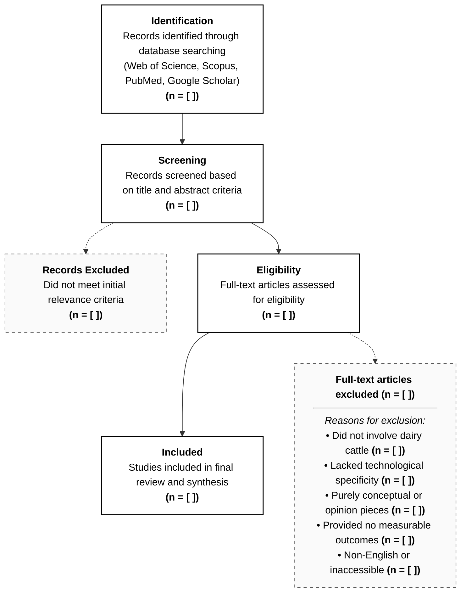

```mermaid
flowchart TD
    %% Define strict neutral/academic styling
    classDef mainBox fill:#ffffff,stroke:#000000,stroke-width:1.5px,color:#000000,font-family:Arial;
    classDef sideBox fill:#fafafa,stroke:#555555,stroke-width:1px,stroke-dasharray: 5 5,color:#000000,font-family:Arial;

    %% Phase 1: Identification
    ID["<b>Identification</b><br/>Records identified through database searching<br/>(Web of Science, Scopus, PubMed, Google Scholar)<br/><b>(n = [ ])</b>"]:::mainBox

    %% Phase 2: Screening
    Screen["<b>Screening</b><br/>Records screened based on title and abstract criteria<br/><b>(n = [ ])</b>"]:::mainBox
    
    ScreenExcl["<b>Records Excluded</b><br/>Did not meet initial relevance criteria<br/><b>(n = [ ])</b>"]:::sideBox

    %% Phase 3: Eligibility (Full-text review)
    Elig["<b>Eligibility</b><br/>Full-text articles assessed for eligibility<br/><b>(n = [ ])</b>"]:::mainBox
    
    FullExcl["<b>Full-text articles excluded (n = [ ])</b><br/><hr/><i>Reasons for exclusion:</i><br/>• Did not involve dairy cattle <b>(n = [ ])</b><br/>• Lacked technological specificity <b>(n = [ ])</b><br/>• Purely conceptual or opinion pieces <b>(n = [ ])</b><br/>• Provided no measurable outcomes <b>(n = [ ])</b><br/>• Non-English or inaccessible <b>(n = [ ])</b>"]:::sideBox

    %% Phase 4: Included
    Inc["<b>Included</b><br/>Studies included in final review and synthesis<br/><b>(n = [ ])</b>"]:::mainBox

    %% Flow Connections
    ID --> Screen
    Screen --> Elig
    Screen -.-> ScreenExcl
    Elig --> Inc
    Elig -.-> FullExcl
```